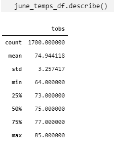
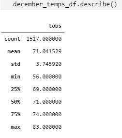
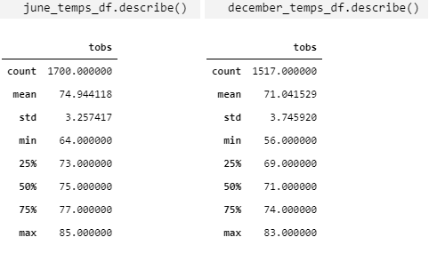
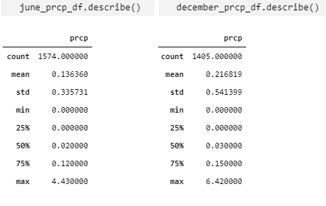

# Surfs up

## Overview

To analyze the weather in Hawaii to give crucial information to an investor in order to make a decision to open a Surf and Shake shop that will be offering surfboards and ice creams to locals and tourists.

## Results

- Min Temp
The minimum temperature in June is 64.0. The minimum temperature in December is 56.0.
- Max Temp 
The maximum temperature in June is 85.0. The maximum temperature in December is 83.0
- Mean (Average)
The mean temperature in June is 74.9. The mean temperature in December is 71.0

## Summary 

Comparing the temperatures’ statistics between December and June, we can see that the month of December is slightly cooler than June with a mean in temperature of 71.0 versus 75.0, respectively.

When comparing the statistics over precipitations, we can see that the month of December has more precipitations than June, with a maximum of 6.42 in December, reaching a maximum of 4.43 in June. Also, we can see that the mean in December is greater than the data in June, it gives us a mean of 0.22 versus 0.14, respectively.  

